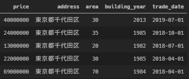

（たぶん長くなるので４回くらいに分けて投稿する）


e-stat APIとかRESAS APIとか，Web APIは便利ですよね。

今回はAPIを作る方法をメモしておくことにします。

APIで提供する機能は「機械学習による予測」としておきます。


# 要件を決める

作るものをざっくり決めておきます。


## 条件

- 東京都の中古マンションのみを対象とする
- リノベーションされた物件は対象外とする（築年数の持つ意味が変わるため）


## 使用する特徴量

| 特徴量  | 説明                     | データ型 |
| ------- | ------------------------ | -------- |
| address | 市区町村レベルまでの住所 | string   |
|         |                          |          |
|         |                          |          |


## 入力（request）/出力（response）

例えば予測のリクエストを

```json
{
    "address": "東京都千代田区",
    "area": 30,
    "building_year": 2013
}
```

のようにして送ると，

```json
{
    "preidcted": 40000000
}
```

のような値を返すAPIとします。


# 予測モデルを作る

不動産価格の予測モデルでも作ってみます。


## データの取得

[土地総合情報システム | 国土交通省](https://www.land.mlit.go.jp/webland/)の[API](https://www.land.mlit.go.jp/webland/api.html)を使います。

```python
import requests
import json
import pandas as pd
import os

url = "https://www.land.mlit.go.jp/webland/api/TradeListSearch"
# 東京都，2005Q3 ~ 2019Q3のデータ（DLに10分ほどかかるので注意）
payload = {"area": 13, "from": 20053, "to": 20193}
response = requests.get(url, params=payload)

data = json.loads(response.text)
df = pd.DataFrame(data["data"])

# 保存
os.mkdir("input")
df.to_csv("input/raw.csv", index=False)
```


## 前処理

まず基礎的な前処理を行い，APIで受け取るデータと同様の状況にしていきます。

```python
import pandas as pd

df = pd.read_csv("input/raw.csv")

# 使用するデータの選択 ----------------------------
# マンションのみを対象にする
is_mansion = df["Type"] == "中古マンション等"
df = df.loc[is_mansion, :]

# リノベーションされた物件は対象外とする
is_not_renovated = df["Renovation"] != "改装済"
df = df.loc[is_not_renovated, :]


# 列名変更 ----------------------------------------
df = df.rename(columns={"TradePrice": "price", "Area": "area"})


# 特徴量の生成 ------------------------------------

# 住所
df["address"] = df["Prefecture"] + df["Municipality"]


# 竣工年の和暦を西暦にする
years = df["BuildingYear"].str.extract(r"(?P<period>昭和|平成|令和)(?P<year>\d+)")
years["year"] = years["year"].astype(float)
years["period"] = years["period"].map({"昭和": 1925, "平成": 1988, "令和": 2019})
df["building_year"] = years["period"] + years["year"]


# apiが利用される場面を考えて四半期を月に変更
years = df["Period"].str.extract(r"(\d+)")[0]
zen2han = {"１": "1", "２": "2", "３": "3", "４": "4"}
quarters = df["Period"].str.extract(r"(\d四半期)")[0]\
    .str.replace("四半期", "").map(zen2han).astype(int)
months = (quarters * 3 - 2).astype(str)
df["trade_date"] = pd.to_datetime(years + "-" + months)


# 使用する変数の取り出し
cols = ["price", "address", "area", "building_year", "trade_date"]
df = df[cols].dropna()

# 保存 --------------------------------------------
df.to_csv("input/basic_data.csv", index=False)

```

こんな感じになります。



- priceは目的変数
- address, area, building_yearはAPIの利用者が入力する
- trade_dateは「APIが利用された日」を使う

という想定です。


## パイプラインの構築

addressは文字列，trade_dateはdatetimeか文字列なので，このまま機械学習モデルに入れるわけにはいきません。

今回はLightGBMを使うので完全にカテゴリカル変数であるaddressはLightGBM内でcategoricalにすればいいとしても，trade_dateは順序があるカテゴリカル変数なので数値にしたいところです。

そんなちょっとした特徴量の加工をするクラスを定義します[^1]

```python
from sklearn.pipeline import Pipeline
from sklearn.base import BaseEstimator, TransformerMixin
import pandas as pd
import numpy as np


class skPlumberBase(BaseEstimator, TransformerMixin):
    """Pipelineに入れられるTransformerのベース"""

    def __init__(self):
        pass

    def fit(self, X, y=None):
        return self

    def transform(self, X):
        return self

    
class ToCategorical(skPlumberBase):
    """LightGBMにcategoryだと認識させるため，
    カテゴリカル変数をpandas category型にする
    """

    def transform(self, X):
        X["address"] = X["address"].astype("category")
        return X
    
    
class Date2Int(skPlumberBase):
    """取引日を数値に変換する"""

    def transform(self, X):
        """unix時間に変換する"""
        trade_date = pd.to_datetime(X["trade_date"]).astype(np.int64) / 10**9
        X["trade_date"] = trade_date.astype(int)
        return X

```

Date2Intは

```
0         2019-07-01
1         2018-10-01
2         2018-07-01
3         2018-04-01
4         2018-04-01
             ...    
137548    2008-01-01
137549    2007-10-01
137550    2007-10-01
137551    2007-07-01
137552    2007-04-01
Name: trade_date, Length: 137553, dtype: object
```

を

```
0         1561939200
1         1538352000
2         1530403200
3         1522540800
4         1522540800
             ...    
137548    1199145600
137549    1191196800
137550    1191196800
137551    1183248000
137552    1175385600
Name: trade_date, Length: 137553, dtype: int32
```

のようにするものです。

unix時間にすると桁数が増えて使用メモリが増えるんですがまぁあくまで例ということで…


[^1]: 参考：[sklearnのpipelineに自分で定義した関数を流し込む - Qiita](https://qiita.com/kazetof/items/fcfabfc3d737a8ff8668)


