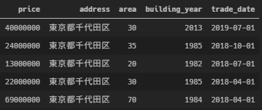
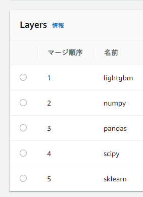
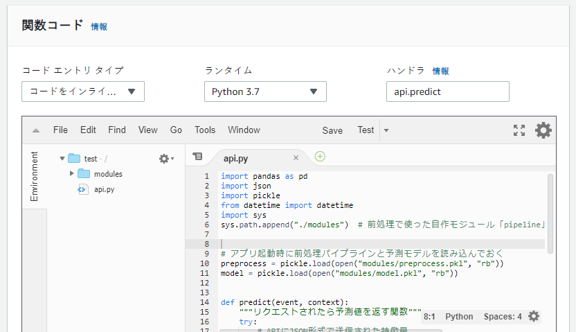
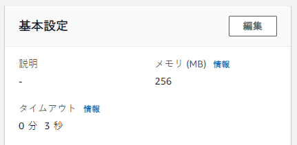
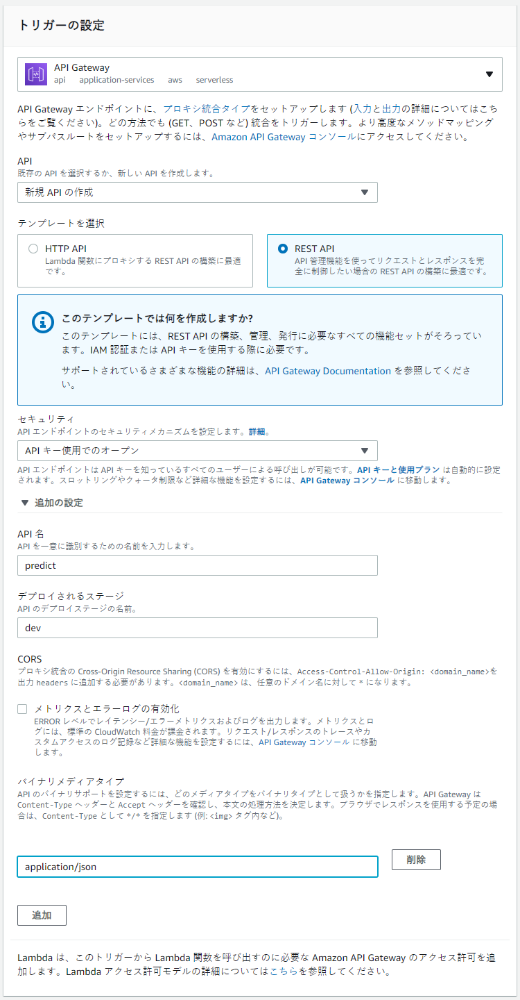
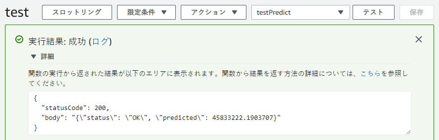

e-stat APIとかRESAS APIとか，Web APIは便利ですよね。

今回はAPIを作る方法をメモしておくことにします。

APIで提供する機能は「機械学習による予測」としておきます。


# 要件を決める

作るものをざっくり決めておきます。

[土地総合情報システム | 国土交通省](https://www.land.mlit.go.jp/webland/)のデータを使って，不動産の価格予測を行うシステムを作ることにします。

## 条件

- 東京都の中古マンションのみを対象とする
- リノベーションされた物件は対象外とする（築年数の持つ意味が変わるため）


## APIに送信する特徴量

以下の特徴量を送ることにします。

| 特徴量        | 説明                     | データ型     |
| ------------- | ------------------------ | ------------ |
| address       | 市区町村レベルまでの住所 | string       |
| area          | 専有面積                 | int or float |
| building_year | 竣工年                   | int or float |


## 入力（request）/出力（response）

例えば予測のリクエストを

```json
{
    "address": "東京都千代田区",
    "area": 30,
    "building_year": 2013
}
```

のようにして送ると，

```json
{
    "status": "OK",
    "preidcted": 40000000
}
```

のような値を返すAPIとします。


# 予測モデルを作る

## データの取得

[土地総合情報システム | 国土交通省](https://www.land.mlit.go.jp/webland/)の[API](https://www.land.mlit.go.jp/webland/api.html)を使います。

```python
import requests
import json
import pandas as pd
import os

url = "https://www.land.mlit.go.jp/webland/api/TradeListSearch"
# 東京都，2005Q3 ~ 2019Q3のデータ（DLに10分ほどかかるので注意）
payload = {"area": 13, "from": 20053, "to": 20193}
response = requests.get(url, params=payload)

data = json.loads(response.text)
df = pd.DataFrame(data["data"])

# 保存
os.mkdir("input")
df.to_csv("input/raw.csv", index=False)
```


## 基礎的な前処理

まず基礎的な前処理を行い，APIで受け取るデータと同様の状況にしていきます。

```python
import pandas as pd

df = pd.read_csv("input/raw.csv")

# 使用するデータの選択 ----------------------------
# マンションのみを対象にする
is_mansion = df["Type"] == "中古マンション等"
df = df.loc[is_mansion, :]

# リノベーションされた物件は対象外とする
is_not_renovated = df["Renovation"] != "改装済"
df = df.loc[is_not_renovated, :]


# 列名変更 ----------------------------------------
df = df.rename(columns={"TradePrice": "price", "Area": "area"})


# 特徴量の生成 ------------------------------------

# 住所
df["address"] = df["Prefecture"] + df["Municipality"]


# 竣工年の和暦を西暦にする
years = df["BuildingYear"].str.extract(r"(?P<period>昭和|平成|令和)(?P<year>\d+)")
years["year"] = years["year"].astype(float)
years["period"] = years["period"].map({"昭和": 1925, "平成": 1988, "令和": 2019})
df["building_year"] = years["period"] + years["year"]


# apiが利用される場面を考えて四半期を月に変更
years = df["Period"].str.extract(r"(\d+)")[0]
zen2han = {"１": "1", "２": "2", "３": "3", "４": "4"}
quarters = df["Period"].str.extract(r"(\d四半期)")[0]\
    .str.replace("四半期", "").map(zen2han).astype(int)
months = (quarters * 3 - 2).astype(str)
df["trade_date"] = pd.to_datetime(years + "-" + months)


# 使用する変数の取り出し
cols = ["price", "address", "area", "building_year", "trade_date"]
df = df[cols].dropna()

# 保存 --------------------------------------------
df.to_csv("input/basic_data.csv", index=False)

```

こんな感じになります。



- priceは目的変数
- address, area, building_yearは予測のときはAPIの利用者が入力する
- trade_dateは予測のときは「APIが利用された日」を使う（システムが作る特徴量）

という想定です。


## 前処理関数の定義

addressは文字列，trade_dateはdatetimeか文字列なので，このまま機械学習モデルに入れるわけにはいきません。

今回はLightGBMを使うので完全にカテゴリカル変数であるaddressはLightGBM内でcategoricalにすればいいとしても，trade_dateは順序があるカテゴリカル変数なので数値にしたいところです。

そんなちょっとした特徴量の加工をするクラスを定義します[^1]

```python
from sklearn.base import BaseEstimator, TransformerMixin
import pandas as pd
import numpy as np


class skPlumberBase(BaseEstimator, TransformerMixin):
    """Pipelineに入れられるTransformerのベース"""

    def __init__(self):
        pass

    def fit(self, X, y=None):
        return self

    def transform(self, X):
        return self


class Date2Int(skPlumberBase):

    def __init__(self, target_col):
        self.target_col = target_col

    def transform(self, X):
        """unix時間に変換する"""
        dates = pd.to_datetime(X[self.target_col]).astype(np.int64) / 10**9
        X[self.target_col] = dates.astype(int)
        return X


class ToCategorical(skPlumberBase):
    """LightGBMにcategoryだと認識させるため，
    カテゴリカル変数をpandas category型にする
    """

    def __init__(self, target_col):
        self.target_col = target_col

    def transform(self, X):
        X[self.target_col] = X[self.target_col].astype("category")
        return X

```

Date2Intは

```
0         2019-07-01
1         2018-10-01
2         2018-07-01
3         2018-04-01
4         2018-04-01
             ...    
137548    2008-01-01
137549    2007-10-01
137550    2007-10-01
137551    2007-07-01
137552    2007-04-01
Name: trade_date, Length: 137553, dtype: object
```

を

```
0         1561939200
1         1538352000
2         1530403200
3         1522540800
4         1522540800
             ...    
137548    1199145600
137549    1191196800
137550    1191196800
137551    1183248000
137552    1175385600
Name: trade_date, Length: 137553, dtype: int32
```

のようにするものです。

unix時間にすると桁数が増えて使用メモリが増えて効率的ではない気がしますが，あくまで例ということで…


## 学習

前処理して，学習して，前処理パイプラインと予測モデルをpickleで保存します。

```python
from sklearn.pipeline import Pipeline
from pipeline import Date2Int, ToCategorical
import pandas as pd
import pickle
import lightgbm as lgb
from sklearn.model_selection import train_test_split

# データ読み込み
df = pd.read_csv("input/basic_data.csv")
y = df["price"]
X = df.drop("price", axis=1)

# 前処理パイプラインの定義
preprocess = Pipeline(steps=[
    ("date_to_int", Date2Int(target_col="trade_date")),
    ("to_category", ToCategorical(target_col="address"))
], verbose=True)

# 前処理
X = preprocess.transform(X)

# データを分割
X_train, X_test, y_train, y_test = train_test_split(
    X, y, test_size=0.2, random_state=42)

# 学習
params = {
    "n_estimators": 100_000,
    "min_child_samples": 15,
    "max_depth": 4,
    "colsample_bytree": 0.7,
    "random_state": 42
}
model = lgb.LGBMRegressor(**params)
model.fit(X_train, y_train,
          eval_metric="rmse",
          eval_set=[(X_test, y_test)],
          early_stopping_rounds=100)
print("best scores:", dict(model.best_score_["valid_0"]))

# 保存
pickle.dump(preprocess, open("preprocess.pkl", "wb"))
pickle.dump(model, open("model.pkl", "wb"))

```

testデータに対するRMSEが1950万円くらいあります。これほど少ない特徴量だとさすがにひどい精度になりますね。

```
best scores: {'rmse': 19500026.074094355, 'l2': 380251016890359.75}
```


[^1]: 参考：[sklearnのpipelineに自分で定義した関数を流し込む - Qiita](https://qiita.com/kazetof/items/fcfabfc3d737a8ff8668)


# APIを作る

## テストを書く

### 作るものを決める

これから作るAPIは，予測したい物件の特徴量を

```json
{
    "address": "東京都千代田区",
    "area": 30,
    "building_year": 2013
}
```

のようにJSONにして送ると，

```json
{
    "status": "OK",
    "preidcted": 40000000
}
```

のようなJSONの値を返すAPIとします。

### テストを書く

```python
import unittest
import requests
import json


class APITest(unittest.TestCase):
    URL = "http://localhost:5000/api/predict"
    DATA = {
        "address": "東京都千代田区",
        "area": 30,
        "building_year": 2013
    }

    def test_normal_input(self):
        # リクエストを投げる
        response = requests.post(self.URL, json=self.DATA)
        # 結果
        print(response.text)  # 本来は不要だが，確認用
        result = json.loads(response.text)  # JSONをdictに変換
        # ステータスコードが200かどうか
        self.assertEqual(response.status_code, 200)
        # statusはOKかどうか
        self.assertEqual(result["status"], "OK")
        # 非負の予測値があるかどうか
        self.assertTrue(0 <= result["predicted"])


if __name__ == "__main__":
    unittest.main()

```

※あくまで例です。実際にちゃんと作るときはもっと沢山（正常系だけでなく異常系も）テストケースを作ります。


## Flaskでアプリを作成

[Flask](https://a2c.bitbucket.io/flask/quickstart.html)はPythonの軽量なWebフレームワーク（Webアプリを簡単に作ることができるライブラリ）で，極めて少ないコード量でアプリを作ることができます。

「機械学習モデルを動かすだけ」みたいな単純な動作をするAPIには最適なフレームワークです。

以下のように書いていきます。

```python
from flask import Flask, request, jsonify, abort
import pandas as pd
import pickle
from datetime import datetime
import sys
sys.path.append("./model")  # 前処理で使った自作モジュール「pipeline」を読み込むためPYTHONPATHに追加
app = Flask(__name__)

# アプリ起動時に前処理パイプラインと予測モデルを読み込んでおく
preprocess = pickle.load(open("model/preprocess.pkl", "rb"))
model = pickle.load(open("model/model.pkl", "rb"))


@app.route('/api/predict', methods=["POST"])
def predict():
    """/api/predict にPOSTリクエストされたら予測値を返す関数"""
    try:
        # APIにJSON形式で送信された特徴量
        X = pd.DataFrame(request.json, index=[0])
        # 特徴量を追加
        X["trade_date"] = datetime.now()
        # 前処理
        X = preprocess.transform(X)
        # 予測
        y_pred = model.predict(X, num_iteration=model.best_iteration_)
        response = {"status": "OK", "predicted": y_pred[0]}
        return jsonify(response), 200
    except Exception as e:
        print(e)  # デバッグ用
        abort(400)


@app.errorhandler(400)
def error_handler(error):
    """abort(400) した時のレスポンス"""
    response = {"status": "Error", "message": "Invalid Parameters"}
    return jsonify(response), error.code


if __name__ == "__main__":
    app.run(debug=True)  # 開発用サーバーの起動

```

前節で書いたテストを走らせるとこうなります

```sh
$ python3 api_test.py 
{
  "predicted": 45833222.1903707, 
  "status": "OK"
}

.
----------------------------------------------------------------------
Ran 1 test in 0.015s

OK
```

期待通り，predictedとstatusが返っているようです。


# uWSGIの設定

Flask.run()で動くサーバは

>    WARNING: This is a development server. Do not use it in a production deployment.
>    Use a production WSGI server instead.

とWarningが出力される通り，あくまで開発用らしいので

デプロイできるようにWSGIサーバを用意します。

選択肢は色々あるようですが，今回はuWSGIを使ってみます。


### インストール

公式ドキュメントに従ってpipから入れます。

[Quickstart for Python/WSGI applications — uWSGI 2.0 documentation](https://uwsgi-docs.readthedocs.io/en/latest/WSGIquickstart.html#installing-uwsgi-with-python-support)

```sh
sudo apt install build-essential python-dev
sudo pip3 install uwsgi
```


### 起動テスト

以下のようにして起動します。

```sh
sudo uwsgi --module=api --callable=app --http-socket=0.0.0.0:80
```

ここで，`--module`の部分には，flaskのアプリが入ったpythonスクリプトのファイル名を指定してください（ここでは`api.py`としています）


### 設定をファイルに記述する

起動時のオプションの指定が面倒なので設定ファイルに記述します。

任意の名前のiniファイル（ここでは`uwsgi.ini`とします）を作り，以下のような感じに設定します。

```ini
[uwsgi]
# WSGI moduleをロード（アプリの.pyファイル名を指定する）
module = api

# set default WSGI callable name
callable = app

# スレッドごとにアプリ全体を読み込む（メモリ消費は増えるが，これを設定しないとLGBMが動かない）
lazy-apps = true

# HTTPの80番ポートを使う
http-socket = 0.0.0.0:80

# worker/processの数
processes = 4

# 各workerのスレッド数
threads = 2

# logを有効化
logto = ./uwsgi.log  

# pidをファイルに入れておく
pidfile = ./uwsgi.pid  

# SIGTERMとSIGQUITの意味を反転させる
die-on-term = true

# memory-reportを有効化
memory-report = true

```

### 起動

このiniファイルを読み込んで起動します。

```sh
sudo uwsgi --ini uwsgi.ini &
```

（logtoを指定している場合，uwsgiからの出力は基本的にlogファイルに行くのでバックグラウンドプロセスとして起動したほうが扱いやすいので`&`をつけています。）

logについては，logの表示用のターミナルをもう一つ用意して，

```sh
tail -f uwsgi.log
```

とすると監視しやすいです。

### リロードと停止

pythonファイルやiniファイルを更新した場合は，アプリをリロードしないと反映されません。リロードはpidfileを使って以下のように行います。

```sh
sudo uwsgi --reload uwsgi.pid
```

停止する場合も同様にpidfileを用います。

```sh
sudo uwsgi --stop uwsgi.pid
```

ちゃんと停止したかどうかを確認するには

```sh
ps aux | grep uwsgi
```

のようにして動作中のプロセスを確認すると良いと思います。


# Herokuにデプロイ

PaaS（Platform as a Service）を使うと簡単にデプロイできるらしいので，Herokuを使ってみます。

[Python | Heroku Dev Center](https://devcenter.heroku.com/categories/python-support)


### Herokuの準備

1. [Heroku](https://jp.heroku.com/)の会員登録を行います。
2. [Heroku Dev Center](https://devcenter.heroku.com/articles/getting-started-with-python#set-up)でHeroku CLIをダウンロードします。
3. CLIでログインしておきます。

```sh
heroku login
```


### uWSGIを設定

[ドキュメント](https://uwsgi-docs.readthedocs.io/en/latest/tutorials/heroku_python.html)を参考に，herokuに向けた設定を行います。

uWSGIの設定ファイルを以下のように変更します。

```ini
[uwsgi]
# WSGI moduleをロード（アプリの.pyファイル名）
module = api

# set default WSGI callable name
callable = app

# スレッドごとにアプリ全体を読み込む（メモリ消費は増えるが，これを設定しないとLGBMが動かない）
lazy-apps = true

# heroku用のポートを使う
http-socket = :$(PORT)

# SIGTERMとSIGQUITの意味を反転させる
die-on-term = true

# memory-reportを有効化
memory-report = true

```


### 必要なファイルを作成

`Procfile`（heroku上で実行されるコマンドを記述するファイル）を作成します。

```
web: uwsgi uwsgi.ini
```

`runtime.txt`を作成し，中にプログラミング言語とバージョンを入れておきます

```
python-3.8.1
```

`requirements.txt`を作成しておき，アプリに必要なライブラリを書いておきます。

```
pandas
scikit-learn
lightgbm
flask
uwsgi
```


### Herokuへデプロイ

Webアプリがおいてある場所をGitのリポジトリにし，追跡してコミットしておきます。

```sh
git init
git add .
git commit -m "first commit"
```

Herokuにアプリをつくります。

```sh
heroku create
```

Herokuにプッシュします。

```sh
git push heroku master
```


### アプリを確認

```sh
heroku open
```

でデプロイしたアプリをブラウザで開いてくれるので，アプリのURLを確認できます。

以前作成したAPIのunittestのURL部分をデプロイしたアプリのURLに書き換えて，テストをしてみます

```sh
$ python3 api_test.py
{"predicted":45833222.1903707,"status":"OK"}

.
----------------------------------------------------------------------
Ran 1 test in 0.833s

OK
```

無事に結果が返ってきました。

herokuのlogを

```
 heroku logs --tail
```

で見ても，POSTリクエストに対応したことが確認できました。


# chaliceでLambdaにデプロイ


[chalice](https://github.com/aws/chalice)を使ってAWS Lambda + API Gatewayでデプロイしていきます。

chaliceはAWS謹製のライブラリで，Flaskライクな文法でWebアプリを作ることができ，コマンド一つでLambda + API Gatewayの構成でデプロイすることができます。


## chaliceのセットアップ

インストール

```bash
pip3 install chalice
```

プロジェクトの作成

```bash
chalice new-project <project_name>
```

プロジェクトを作成すると，`app.py`と`requirements.txt`の入ったディレクトリが作られるので，そちらに移動して`app.py`を書き換えていきます。


## app.pyの書き換え

最初はこんな感じになってます。

```python
from chalice import Chalice

app = Chalice(app_name='project_name')

@app.route('/')
def index():
    return {'hello': 'world'}
```

これを以下のように書き換えます。

```python
from chalice import Chalice, Response
import pandas as pd
import pickle
from datetime import datetime
import sys
import json
sys.path.append("./modules")  # 前処理で使った自作モジュール「pipeline」を読み込むためPYTHONPATHに追加
app = Chalice(app_name='with_chalice')


# アプリ起動時に前処理パイプラインと予測モデルを読み込んでおく
preprocess = pickle.load(open("modules/preprocess.pkl", "rb"))
model = pickle.load(open("modules/model.pkl", "rb"))


@app.route('/predict', methods=["POST"])
def predict():
    """/predict にPOSTリクエストされたら予測値を返す関数"""
    try:
        # APIにJSON形式で送信された特徴量
        request = app.current_request
        X = pd.DataFrame(request.json_body, index=[0])
        # 特徴量を追加
        X["trade_date"] = datetime.now()
        # 前処理
        X = preprocess.transform(X)
        # 予測
        y_pred = model.predict(X, num_iteration=model.best_iteration_)
        response = {"status": "OK", "predicted": y_pred[0]}
        return Response(body=json.dumps(response),
                        headers={'Content-Type': 'application/json'},
                        status_code=200)
    except Exception as e:
        print(e)  # デバッグ用
        response = {"status": "Error", "message": "Invalid Parameters"}
        return Response(body=json.dumps(response),
                        headers={'Content-Type': 'application/json'},
                        status_code=400)

```


## requirements.txtは空のままで

機械学習モデル部分で使用しているライブラリを載せるんですが，Lambda関数に含めることができるのは50MBまでなので，LightGBM（とその依存ライブラリ）だけで超過します。

なのでライブラリは後述するLayerという仕組みを使って別のルートからアップロードすることにし，requirements.txtはそのままにします。


## ローカルでテスト

```
chalice local
```

でlocalhost:8000にサーバーが起動するのでPOSTリクエストを投げてテストします。

（存在しないURLにリクエストを投げたときにNot Foundじゃなく`{"message":"Missing Authentication Token"}`が返ってくるというややミスリーディングな仕様なのでご注意を）

```bash
$ python3 api_test.py 
{"status": "OK", "predicted": 45833222.1903707}
.
----------------------------------------------------------------------
Ran 1 test in 0.064s

OK
```

ローカルで問題なく動くようであればデプロイしていきます。


## AWS Credentials

deployの前にAWSの資格情報を編集します。

アクセスキーはAWSコンソールのセキュリティ資格情報のところで作成します。

```bash
$mkdir ~/.aws
$ cat >> ~/.aws/config
[default]
aws_access_key_id=YOUR_ACCESS_KEY_HERE
aws_secret_access_key=YOUR_SECRET_ACCESS_KEY
region=YOUR_REGION (such as us-west-2, us-west-1, etc)
```


## LambdaのLayerにパッケージを追加する

LightGBM, scikit-learnなどの外部ライブラリをrequirements.txtに記述してchaliceのデプロイ時にアップロードさせる方法（直接アップロード）では，圧縮済みファイルで50MBが上限となります。

Numpy, Scipy, Pandas, LightGBM, Scikit-learnなどを使っている今回のプロジェクトは50MB以下に収まらないので，直接アップロードはできません。

しかし，[ここ](https://docs.aws.amazon.com/ja_jp/lambda/latest/dg/limits.html)を見ると，直接アップロードなら50MBが上限でも，Layerから読み込む方法なら解凍時で250MBまでは使えるようです。

なので，lambda関数にまとめるのではなく，Layerとして別口でアップロードしておき，Lambda関数から読み込ませるようにします。

以下の記事を参考にしてLayerを作っていきます。

- [pandasをLambdaのLayerとして追加する - Qiita](https://qiita.com/thimi0412/items/4c725ec2b26aef59e5bd)
- [Python の AWS Lambda デプロイパッケージ - AWS Lambda](https://docs.aws.amazon.com/ja_jp/lambda/latest/dg/lambda-python-how-to-create-deployment-package.html)


### 1. Amazon Linux2 OSのEC2インスタンスを立ち上げ，sshで接続する
   - コンパイラ言語を利用しているライブラリはLambda（2019年からAmazon Linux2で動いている）と同じOSでインストールしたライブラリを使う必要があるようです
     （[Python3.7ランタイムのAWS LambdaでC拡張ライブラリを使用したい！ - Qiita](https://qiita.com/rkhcx/items/999fe28b541334cd8464)）
   - コンパイラ言語を使用していないライブラリ（例：tqdm）ならEC2じゃない場所で以下の2~4の作業を行えば大丈夫です。


### 2. pip installしてzipにする

```bash
# python3のインストール
sudo yum update -y
sudo yum install python3-devel python3-libs python3-setuptools -y
sudo python3 -m pip install --upgrade pip

# numpyのzip化 -------------
mkdir python
pip3 install -t ./python/ numpy
zip -r numpy.zip python
rm -r python

# scipyのzip化 -------------
mkdir python
pip3 install -t ./python/ scipy
# numpyは別Layerにするので消す
rm -r ./python/numpy*
zip -r scipy.zip python
rm -r python

# pandasのzip化 ------------
mkdir python
pip3 install -t ./python/ pandas==0.25.3
# numpyは別Layerにするので消す
rm -r ./python/numpy*
zip -r pandas.zip python
rm -r python

# sklearnのzip化 -----------
mkdir python
pip3 install -t ./python/ sklearn
# numpy, scipyは別Layerにするので消す
rm -r ./python/numpy* ./python/scipy*
zip -r sklearn.zip python
rm -r python

# lightgbmのzip化 ----------
mkdir python
pip3 install -t ./python/ --no-deps lightgbm
zip -r lightgbm.zip python
rm -r python

```


### 3. zipをダウンロード

```
exit
```

でEC2を抜けたら

```
scp -i ~/.ssh/[pemファイル名].pem ec2-user@[IPv4]:~/*.zip .
```

のような感じでローカルにダウンロードします。


### 4. zipをアップロード

- AWSコンソール→Lambda→Layer→「レイヤーの作成」からzipをアップロードします

   - レイヤー名はpythonコードでimportするときの名前にします


### 5. Layerの追加

AWSコンソールのLambda関数の画面から，作成中のAPIの関数に先程作成したLayerを追加します。


## ソースコード以外のデプロイしたいファイルはvendorに入れる

chaliceでdeployしたいファイルが有る場合は`vendor`というディレクトリを作って入れる必要があります（[Chalice documentation](https://chalice.readthedocs.io/en/latest/topics/packaging.html)）。

今回は予測モデルのpklファイルを入れていた`modules`というディレクトリを`vendor`に入れます

```bash
mkdir vendor
cp -r modules/ vendor/
```


## デプロイする

ようやくデプロイです！

```bash
chalice deploy
```


## 動作確認

LambdaのURLにPOSTリクエストを投げて確認します。

```bash
$ python3 api_test.py
{"status": "OK", "predicted": 45833222.1903707}
.
----------------------------------------------------------------------
Ran 1 test in 3.051s

OK
```

ちゃんと動作しているようです。


## ライブラリ関係

現在のAPIは以下のようなライブラリを使っております

| 名前     | サイズ | 使用理由       |
| -------- | ------ | -------------- |
| lightgbm | 約4MB  | 予測に利用     |
| sklearn  | 約27MB | LightGBMの依存 |
| numpy    | 約77MB | LightGBMの依存 |
| scipy    | 約86MB | LightGBMの依存 |
| pandas   | 約43MB | 前処理で使用   |

AWS Lambdaでこういう外部ライブラリをLayerから読み込む場合，250MBが上限になるのですが，scipy, numpyが重いのでflaskを含めて約242MB。Djangoだと約24MBあって250MBを超えてしまうので，ここはFlaskの軽量さが活きているなと感じました。


# Lambdaにデプロイ


## Lambda関数を作成

AWS コンソールから作成します。


## LambdaのLayerにパッケージを追加する

ソースコードと一緒に直接アップロードできるのは50MBまでなので，NumpyやらScikit-learnやらを使っている今回のコードはその制約をオーバーしてしまいます。

しかし，Layerとして別口でアップロードしておき，Lambda関数から読み込ませるようにする場合は250MBまで読み込めます。以下ではLayerを作っていきます。


### 1. Amazon Linux2 OSのEC2インスタンスを立ち上げ，sshで接続する

   - コンパイラ言語を利用しているライブラリはLambda（2019年からAmazon Linux2で動いている）と同じOSでインストールしたライブラリを使う必要があるようです
     （[Python3.7ランタイムのAWS LambdaでC拡張ライブラリを使用したい！ - Qiita](https://qiita.com/rkhcx/items/999fe28b541334cd8464)）
   - コンパイラ言語を使用していないライブラリ（例：tqdm）ならEC2じゃない場所で以下の2~4の作業を行えば大丈夫です。


### 2. pip installしてzipにする

```bash
# python3のインストール
sudo yum update -y
sudo yum install python3-devel python3-libs python3-setuptools -y
sudo python3 -m pip install --upgrade pip

# numpyのzip化 -------------
mkdir python
pip3 install -t ./python/ numpy
zip -r numpy.zip python
rm -r python

# scipyのzip化 -------------
mkdir python
pip3 install -t ./python/ scipy
# numpyは別Layerにするので消す
rm -r ./python/numpy*
zip -r scipy.zip python
rm -r python

# pandasのzip化 ------------
mkdir python
pip3 install -t ./python/ pandas==0.25.3
# numpyは別Layerにするので消す
rm -r ./python/numpy*
zip -r pandas.zip python
rm -r python

# sklearnのzip化 -----------
mkdir python
pip3 install -t ./python/ sklearn
# numpy, scipyは別Layerにするので消す
rm -r ./python/numpy* ./python/scipy*
zip -r sklearn.zip python
rm -r python

# lightgbmのzip化 ----------
mkdir python
pip3 install -t ./python/ --no-deps lightgbm
zip -r lightgbm.zip python
rm -r python

```


### 3. zipをダウンロード

```
exit
```

でEC2を抜けたら

```
scp -i ~/.ssh/[pemファイル名].pem ec2-user@[IPv4]:~/*.zip .
```

のような感じでローカルにダウンロードします。


### 4. zipをアップロード

- AWSコンソール→Lambda→Layer→「レイヤーの作成」からzipをアップロードします

  - レイヤー名はpythonコードでimportするときの名前にします


### 5. Layerの追加

AWSコンソールのLambda関数の画面から，作成中のAPIの関数に先程作成したLayerを追加します。

（マージ順序は気にしなくて大丈夫です）




## APIのコードを修正

Lambda用に修正してアップロードします。


### コードの書き換え

前回までのAPIのコードを，こんな感じに書き換えます。

```python
import pandas as pd
import json
import pickle
from datetime import datetime
import sys
sys.path.append("./modules")  # 前処理で使った自作モジュール「pipeline」を読み込むためPYTHONPATHに追加

# アプリ起動時に前処理パイプラインと予測モデルを読み込んでおく
preprocess = pickle.load(open("modules/preprocess.pkl", "rb"))
model = pickle.load(open("modules/model.pkl", "rb"))


def predict(event, context):
    """リクエストされたら予測値を返す関数"""
    try:
        # リクエストのbodyをjsonからdictに変換（API Gatewayのリクエスト形式に対応）
        data = json.loads(event['body'])
        # APIにJSON形式で送信された特徴量
        X = pd.DataFrame(data, index=[0])
        # 特徴量を追加
        X["trade_date"] = datetime.now()
        # 前処理
        X = preprocess.transform(X)
        # 予測
        y_pred = model.predict(X, num_iteration=model.best_iteration_)
        response = {"status": "OK", "predicted": y_pred[0]}
        # レスポンスもbodyにjsonを入れる（API Gatewayの仕様に対応）
        return {
            "body": json.dumps(response),
            "statusCode": 200
        }
    except Exception:
        response = {"status": "Error", "message": "Invalid Parameters"}
        return {
            "body": json.dumps(response),
            "statusCode": 400
        }

```

このようなreturnにする理由は，API Gatewayにレスポンスを指示するためです。

（参考：[API ゲートウェイでの「不正な Lambda プロキシ応答」または 502 エラーの解決](https://aws.amazon.com/jp/premiumsupport/knowledge-center/malformed-502-api-gateway/)）


### zipファイルにしてアップロード

予測モデルの.pklファイルなどとともにzipにしてAWSコンソールからアップロードし，「保存」を押します。


### Lambdaの設定

コードエディタのような画面がでてきたら「ハンドラ」部分を`ファイル名.関数名` の形にします。



また，その下に「基本設定」という部分があるので，メモリを引き上げておきます。

今回の例では200MB程度あれば十分のはずです。




## API Gatewayの設定

REST APIにします




## 動作確認

### AWSコンソール上でテスト

AWSコンソール上部でテストイベントを作成し，以下の値を入力します。

```js
{
    "address": "東京都千代田区",
    "area": 30,
    "building_year": 2013
}
```

テストイベントを保存したら「テスト」のボタンを押してテストします。

以下のような画面になれば成功です。




### ローカルからテスト

AWSコンソール上のAPI Gatewayの部分にAPIのエンドポイント（URL）とAPIキーがあるので，そこへPOSTリクエストを送ります。

```python
import unittest
import requests
import json


class APITest(unittest.TestCase):
    URL = "APIエンドポイント"
    HEADERS = {"x-api-key": "APIキー"}
    DATA = {
        "address": "東京都千代田区",
        "area": 30,
        "building_year": 2013
    }

    def test_normal_input(self):
        # リクエストを投げる
        response = requests.post(self.URL, json=self.DATA, headers=HEADERS)
        # 結果
        print(response.text)  # 本来は不要だが，確認用
        result = json.loads(response.text)  # JSONをdictに変換
        # ステータスコードが200かどうか
        self.assertEqual(response.status_code, 200)
        # statusはOKかどうか
        self.assertEqual(result["status"], "OK")
        # 非負の予測値があるかどうか
        self.assertTrue(0 <= result["predicted"])


if __name__ == "__main__":
    unittest.main()

```

実行したところ，ちゃんと動きました

```
{"status": "OK", "predicted": 45833222.1903707}
.
----------------------------------------------------------------------
Ran 1 test in 0.398s

OK
```

もちろんcurlコマンドでも検証できます。

```sh
curl https://xxxxxxxxxxxxxxxx.execute-api.ap-northeast-1.amazonaws.com/dev/test \
-d '{"address": "東京都千代田区", "area": 30, "building_year": 2013}' \
-H 'x-api-key: xxxxxxxxxxxxxxxxxxxxxxxxxxxxxxxx' \
-v
```

```
{"status": "OK", "predicted": 45833222.1903707}
```


# EC2にデプロイ

## デプロイ

ローカルで動くAPIができているので，それをアップロードすれば動きます


# フロントエンドを作る

Vueのれんしゅう


